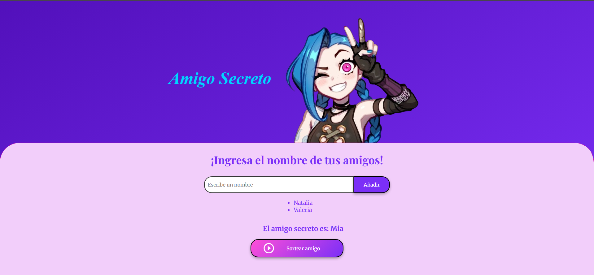

# Challenge-amigo-secreto

Un proyecto simple e interactivo para organizar un **sorteo de Amigo Secreto**.  
Permite ingresar los nombres de tus amigos, listarlos y sortear aleatoriamente a cada uno de ellos.  

---

## Características
- Agregar nombres a una lista.
- Evita nombres duplicados o vacíos.
- Muestra la lista de amigos ingresados con estilo personalizado.
- Sortea un amigo secreto de manera aleatoria.
- Elimina automáticamente los nombres sorteados para que no se repitan.
- Interfaz visual amigable con tipografía personalizada y diseño responsivo.

---

## Tecnologías utilizadas
- **HTML5** → estructura de la página.  
- **CSS3** → estilos y diseño visual.  
- **JavaScript (ES6)** → lógica para agregar, listar y sortear amigos.  
- **Google Fonts** → tipografía elegante.  
- **GitHub Pages** → despliegue del proyecto.

---

## Cómo usar
1. Ingresa el nombre de tus amigos en el campo de texto.  
2. Haz clic en **Añadir** para sumarlos a la lista.  
3. Una vez agregados todos los nombres, presiona **Sortear amigo**.  
4. El sistema mostrará quién es tu **Amigo Secreto**.  

---

## Demo en línea
El proyecto está publicado con **GitHub Pages** y lo puedes ver aquí:  
👉 [Amigo Secreto](https://rociomaldonado.github.io/Challenge-amigo-secreto/)

---

## Vista previa

---

## Autor
Proyecto desarrollado por **[Rocío Maldonado]**
